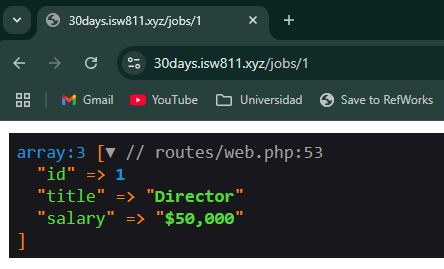
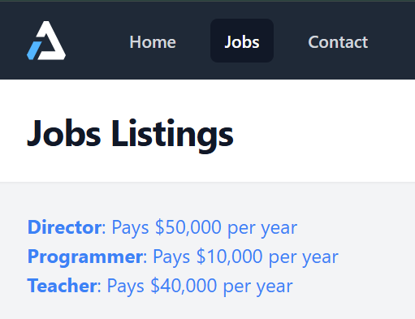
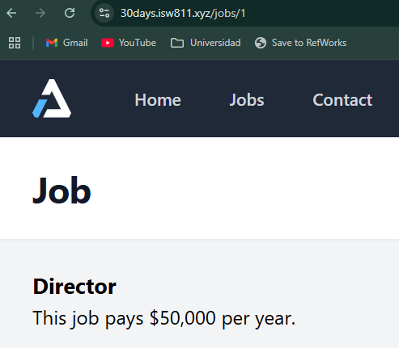

[< Volver al índice](/docs/chapter/babySteps.md)

# Baby Steps - Episodios 05 a 07

## 5. Episodio 05 - Style the Currently Active Navigation
En este episodio, aprendimos a resaltar la navegación activa en nuestro sitio web utilizando clases de TailwindCSS. Modificamos la barra de navegación y creamos un `nav-link` personalizado para manejar la lógica de la navegación activa.

### Crear un componente de enlace de navegación
Creamos un componente de enlace de navegación llamado `nav-link.blade.php` en el directorio `resources/views/components`. Este componente se encargará de aplicar las clases adecuadas según si el enlace está activo o no.

```php
@props(['active' => false])

<a class="{{ $active ? 'bg-gray-900 text-white' : 'text-gray-300 hover:bg-gray-700 hover:text-white'}} rounded-md px-3 py-2 text-sm font-medium "
    aria-current="{{ $active ? 'page' : 'false' }}"
    {{ $attributes }}
>{{$slot}}</a>
```

### Usar el componente de enlace de navegación
Para usar el componente de enlace de navegación, modificamos el archivo `layout.blade.php` y reemplazamos los enlaces de navegación por el componente `x-nav-link`. Esto nos permite aplicar la lógica de navegación activa de manera más sencilla.

```php
<div class="ml-10 flex items-baseline space-x-4">
  <x-nav-link href="/" :active="request()->is('/')">Home</x-nav-link>
  <x-nav-link href="/about" :active="request()->is('about')">About</x-nav-link>
  <x-nav-link href="/contact" :active="request()->is('contact')">Contact</x-nav-link>
</div>
```

### Resaltar la navegación activa
El componente `x-nav-link` utiliza la propiedad `active` para determinar si el enlace debe tener un estilo activo o no. Si la ruta actual coincide con el enlace, se aplicarán las clases de TailwindCSS para resaltar el enlace como activo.

## 6. Episodio 06 - View Data and Route Wildcards
En este episodio, averiguamos cómo pasar datos del archivo de rutas a las vistas.

### Pasar datos a la vista
Para pasar datos a una vista, utilizamos el método `view()` en nuestras rutas. Por ejemplo, para pasar un título a la vista de inicio:

```php
Route::get('/', function () {
    return view('home', [
      'greeting' => 'Hello'
      ]);
});
```

### Usar datos en la vista
Para mostrar los datos en la vista, simplemente usamos la sintaxis Blade para imprimir las variables.

```blade
<h1>{{ $greeting }}</h1>
```
### Usar Arrays en las vistas
Para pasar un array a la vista, lo hacemos de manera similar. Por ejemplo, para pasar una lista de trabajos:

```php
Route::get('/jobs', function () {
    return view('jobs', [
        'jobs' => [
            [
                'id' => 1,
                'title' => 'Director',
                'salary' => '$50,000'
            ],
            [
                'id' => 2,
                'title' => 'Programmer',
                'salary' => '$10,000'
            ],
            [
                'id' => 3,
                'title' => 'Teacher',
                'salary' => '$40,000'
            ]
        ]
    ]);
});
```

Se vería así:



### Usar comodines en las rutas
Para manejar rutas dinámicas, utilizamos comodines en las rutas. Por ejemplo, para una ruta que maneja un ID de trabajo:

```php
Route::get('/jobs/{id}', function ($id) {
    $jobs = [
        [
            'id' => 1,
            'title' => 'Director',
            'salary' => '$50,000'
        ],
        [
            'id' => 2,
            'title' => 'Programmer',
            'salary' => '$10,000'
        ],
        [
            'id' => 3,
            'title' => 'Teacher',
            'salary' => '$40,000'
        ]
    ];

    $job = Arr::first($jobs, fn($job) => $job['id'] == $id);

    return view('job', ['job' => $job]);
});
```

Desde la página de `jobs` podemos ver la lista de los trabajos y al hacer clic en uno de ellos, nos llevará a una página específica del trabajo con su título y salario.

**Lista de trabajos**



**Trabajo específico**



## 7. Episodio 07 - Autoloading, Namespaces, and Models
En este episodio, se limpió el archivo de rutas `web.php`, además, aprendimos sobre modelos y se creó el primer modelo, también aprendimos un poco más sobre la encapsulación de datos y comportamiento y de cómo manejar los errores 404 y de cómo se convierten automáticamente en respuestas por Laravel.

### Creación del modelo
Para crear un modelo, simplemente creamos un archivo PHP en el directorio `app/Models`. Creamos `Job.php`, donde definimos la clase `Job`, que encapsula dos funciones estaticas, una para obtener todos los trabajos y otra para encontrar un trabajo por su ID, con el siguiente contenido:

```php
<?php

namespace App\Models;

use Illuminate\Support\Arr;

class Job {
    public static function all(): array
    {
        return [
            [
                'id' => 1,
                'title' => 'Director',
                'salary' => '$50,000'
            ],
            [
                'id' => 2,
                'title' => 'Programmer',
                'salary' => '$10,000'
            ],
            [
                'id' => 3,
                'title' => 'Teacher',
                'salary' => '$40,000'
            ]
        ];
    }

    public static function find(int $id):array
    {
        $job = Arr::first(static::all(), fn($job) => $job['id'] == $id);

        if (! $job){
            abort(404);
        }
        return $job;
    }
}
```

### Uso del modelo en las rutas
Para utilizar el modelo en las rutas, primero importamos o llamamos al modelo por medio de `use App\Models\Job;` y luego simplemente llamamos a los métodos estáticos que definimos en el modelo. Por ejemplo, en lugar de definir la lógica para obtener todos los trabajos directamente en la ruta, podemos usar el modelo `Job`:

```php
Route::get('/jobs', function () {
    return view('jobs', [
        'jobs' => Job::all()
    ]);
});

Route::get('/jobs/{id}', function ($id) {
    $job = Job::find($id);
    return view('job', ['job' => $job]);
});
```
