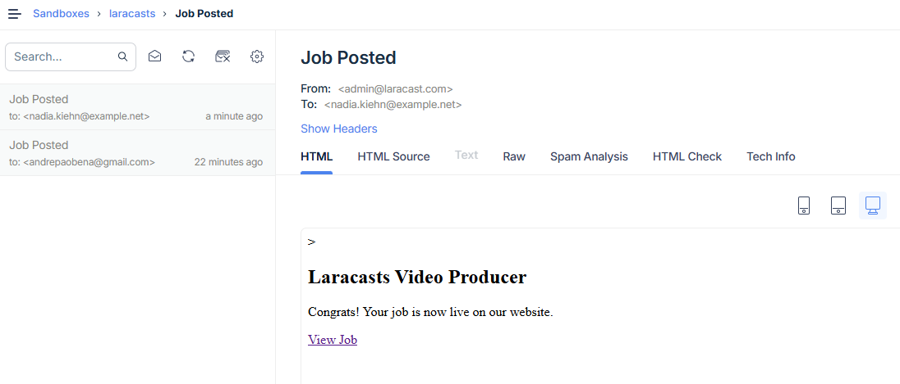

[< Volver al índice](/docs/chapter/digginDeeper.md)

# Diggin Deeper - Episodios 24 a 26

## 24. Episodio 24 - How to Preview and Send Email Using Mailable Classes

En este episodio, aprenderemos a enviar correos electrónicos utilizando las clases Mailable de Laravel. Estas clases nos permiten estructurar y enviar correos de manera eficiente.

### Creación de un Mailable

Usa Artisan para generar una clase Mailable:

```bash
php artisan make:mail JobPosted
```

Esto genera la clase `app/Mail/JobPosted.php` con 3 secciones importantes:
+ Envelope: Define el asunto, remitente, reply-to y etiquetas.
+ Content: Indica la vista Blade que será usada como cuerpo del correo.
+ Attachments: Permite añadir archivos adjuntos.

### Creación de la Vista del Correo

Ubica el contenido en:
`resources/views/mail/job-posted.blade.php`

```php
<p>Congrats, your job is now live on our website.</p>
```

### Previsualización del Correo

Agrega una ruta temporal para ver el correo en el navegador:

```php
Route::get('/test', function () {
    return new \App\Mail\JobPosted();
});
```
Accede a `/test` en el navegador para ver el correo.

### Envío del Correo

Utiliza el facade `Mail` para enviar el mailable:

```php
use Illuminate\Support\Facades\Mail;

Mail::to('jeffrey@laracasts.com')->send(new \App\Mail\JobPosted());
```

> En entornos locales sin SMTP configurado, los correos se registran en `storage/logs/laravel.log`.

### Configuración del Correo

Edita `.env` o `config/mail.php` con los datos de tu proveedor SMTP.

```env
MAIL_MAILER=smtp
MAIL_HOST=sandbox.mailtrap.io
MAIL_PORT=2525
MAIL_USERNAME=your_username
MAIL_PASSWORD=your_password
MAIL_FROM_ADDRESS=info@laracasts.com
MAIL_FROM_NAME="Laracasts"
```

### Pasar Datos al Mailable

Pasa variables al constructor y exponlas como propiedades públicas:

```php
public $job;

public function __construct(Job $job)
{
    $this->job = $job;
}
```

En la vista Blade accede con `{{ $job->title }}` o similares.

### Generar URLs en Correos

Usa el helper `url()` para incluir enlaces válidos:

```php
<a href="{{ url('/jobs/' . $job->id) }}">View your job listing</a>
```

### Vista del Correo desde Mailtrap
Accede a Mailtrap para ver el correo enviado. Configura tu cuenta y usa las credenciales en `.env`.

La vista del correo se verá como:



## 25. Episodio 25 - Queues Are Easier Than You Think

En este episodio, aprenderemos sobre las colas en Laravel y cómo pueden simplificar el procesamiento de tareas en segundo plano.

### ¿Por qué usar colas?
Las colas permiten ejecutar tareas que consumen mucho tiempo (como enviar correos) en segundo plano, mejorando así la experiencia del usuario al responder de inmediato.

---

### Configuración de Queues

Laraver soporta varios **drivers de cola**:
+ `sync`: ejecuta las tareas inmediatamente (por defecto, útil en desarrollo).
+ `database`: almacena las tareas en la base de datos.
+ `beanstalkd`, `sqs`, `redis`: opciones avanzadas para producción.

En `.env`, selecciona el driver:

```env
QUEUE_CONNECTION=database
```

El driver `database` necesita las talas `jons` y `failed_jobs`.

### Encolar el Envío de Correos

Cambia el método `send()` a `queue()`:
```php
// Antes
Mail::to($user)->send(new JobPosted($job));

// Después
Mail::to($user)->queue(new JobPosted($job));

```
Así, el correo se enviará en segundo plano.

### Ejecutar el Queue Worker
Para procesar las tareas en cola, ejecuta el worker:

```bash
php artisan queue:work
```

Esto iniciará un proceso que escuchará y ejecutará las tareas en cola.
> **Importante:** reinicia el proceso si cambias el código de los jobs.

### Closures Encoladas

Puedes encolar funciones anónimas simples:

```php
dispatch(function () {
    Log::info('Hello from the queue');
})->delay(now()->addSeconds(5));
```

### Crear Clases de Jobs Dedicadas

Para tareas más complejas, crea una clase de job:

```bash
php artisan make:job TranslateJob
```

Define la lógica en el método `handle()` y ejecútalo con `dispatch()`:

```php
TranslateJob::dispatch($jobListing);
```