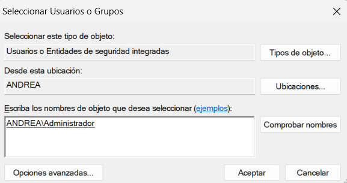

[< Volver al índice](/docs/chapter/digginDeeper.md)

# Diggin Deeper - Episodio 26 - Get Your Build Process in Order

## Error de Symlink en Windows
Cuando utilizamos Vagrant para virtualizar sistemas operativos tipo GNU/Linux sobre Windows 7, 8, 10, 11, etc.,
puede presentarse un error cuando herramientas como NPM intentan crear enlaces simbólicos (symlinks) al
momento de instalar dependencias. Esto ocurre debido a que Windows, por defecto, no permite a los usuarios
sin privilegios administrativos crear symlinks. A continuación, se explican los pasos para habilitar esta
funcionalidad en ediciones de Windows como Home Edition, que no incluyen ciertas herramientas administrativas
por defecto.

### Paso 1  — Habilitar el editor de políticas de seguridad en «Windows Home Edition»

#### Habilitar _Local Security Policy_ (`secpol.msc`)

1. **Abra la terminal CMD como administrador**
2. **Ejecute el siguiente comando para agregar los componentes del sistema y habilitar la herramienta**
    ```bash
    FOR %F IN ("%SystemRoot%\servicing\Packages\Microsoft-Windows-GroupPolicy-ClientTools-Package~*.mum") DO (DISM /Online /NoRestart /Add-Package:"%F")
    ```
3. **Ejecute el segundo comando para añadir la extensión que soporta las políticas de grupo**
    ```bash
    FOR %F IN ("%SystemRoot%\servicing\Packages\Microsoft-Windows-GroupPolicy-ClientExtensions-Package~*.mum") DO (DISM /Online /NoRestart /Add-Package:"%F")
    ```
4. **Reinicie su computadora**

### Paso 2 — Otorgar permisos para crear Symlinks

1. **Abra el editor de políticas de seguridad** (`secpol.msc`): Precione `Win + R`, escriba `secpol.msc` y presione `Enter`.

    

2. **Navegue a la siguiente ruta**: `Políticas Locales > Asignación de Derechos de Usuario`
3. **Busque la política llamada** `Crear enlaces simbólicos` y haga doble clic en ella.

    
4. **Haga clic en el botón `Agregar usuario o grupo...`**

    

5. **Seleccione la opción** ``Opciones avanzadas...``

    

6. **Haga clic en `Buscar ahora` y seleccione su usuario de Windows**

    

7. **Haga clic en `Aceptar` y luego en `Aplicar` para guardar los cambios**

    

8. **Finalmente, confirme los cambios haciendo clic en `Aceptar`**

    
    
9. **Reinicie su computadora para que los cambios surtan efecto**

---

## Introducción a Vite y Tailwind CSS
En este episodio, configuramos Vite y Tailwind CSS en nuestro proyecto Laravel dentro de un entorno Vagrant, con certificados SSL (HTTPS). Este proceso optimiza el manejo de assets, permite recarga en caliente y asegura que los estilos de Tailwind se integren
correctamente en la aplicación. La aplicación estará disponible en `https://30days.isw811.xyz` (HTTPS).

### Configuración del Entorno
**Verificación de Node.js y npm**
En la máquina virtual en el directorio de `/vagrant/sites/30days.isw811.xyz`, ejecutamos los siguientes comandos para verificar que Node.js y npm están instalados:

```bash
node -v
npm -v
```

**Actualización del archivo `.env`**
Configuramos el archivo `.env` para que apunte a la URL correcta:

```env
APP_URL= https://30days.isw811.xyz
```

### Configuración de Vite
En el archivo `vite.config.js`, configuramos Vite para que maneje los assets de nuestro proyecto Laravel. Asegúrate de que el archivo tenga la siguiente estructura:

```javascript
import { defineConfig } from "vite";
import laravel from "laravel-vite-plugin";
import fs from "fs";
export default defineConfig({
    plugins: [
        laravel({
            input: ["resources/js/app.js"],
            refresh: true,
        }),
    ],
    server: {
        host: "0.0.0.0",
        port: 5173,
        strictPort: true,
        watch: {
            usePolling: true, // Necesario para entornos virtuales (Vagrant, WSL2, etc.)
            interval: 100, // Intervalo de sondeo en milisegundos
            ignored: ["!**/dist/"],
        },
        https: {
            key: fs.readFileSync("/vagrant/ssl/30days.isw811.xyz/privkey.pem"),
            cert: fs.readFileSync("/vagrant/ssl/30days.isw811.xyz/fullchain.pem"),
        },
        hmr: {
            protocol: "wss",
            host: "30days.isw811.xyz",
            port: 5173,
        },
    },
});
```

**Ejecutar Vite**

Para iniciar el servidor de desarrollo de Vite, ejecutamos el siguiente comando en la terminal:

```bash
npm run dev
npm run build
```
> `npm run dev` inicia el servidor de desarrollo, mientras que `npm run build` compila los assets para producción.

### Incluir Assets en Laravel
En el archivo `resources/views/components/layout.blade.php`, incluimos los assets de Vite:

```php
@vite(['resources/js/app.js'])
```
Esto los carga automáticamente desde el servidor de desarrollo o desde `public/build`.

### Integrar Tailwind CSS

**Instalación de Tailwind CSS**
```bash
npm install -D tailwindcss postcss autoprefixer
npx tailwindcss init
```

**Configuración de Tailwind CSS**
Creamos el archivo `tailwind.config.js` con la siguiente configuración:

```javascript
/** @type {import('tailwindcss').Config} */
export default {
    content: [
        "./resources/**/*.blade.php",
        "./resources/**/*.js",
        "./resources/**/*.vue",
    ],
    theme: {
        extend: {
            colors: {
                laracasts: "rgb(50,138,241)",
            },
        },
    },
    plugins: [],
};
```

**Agregar Tailwind a los estilos**
Creamos el archivo `resources/css/app.css` y añadimos las directivas de Tailwind

```css
@tailwind base;
@tailwind components;
@tailwind utilities;
```

### Compilar para Producción
Cuando terminamos el desarrollo y queremos compilar para producción, ejecutamos:

```bash
npm run build
```
Esto generará los archivos CSS y JS optimizados en el directorio `public/build`.