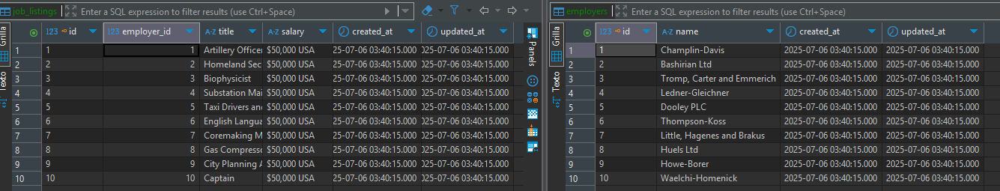

[< Volver al índice](/docs/chapter/eloquent.md)

# Eloquent - Episodios 08 a 11

## 8. Episodio 08 - Introduction to Migrations
En este episodio, se introduce el concepto de migraciones en Laravel. Las migraciones son una forma de versionar la base de datos, permitiendo a los desarrolladores definir y modificar la estructura de la base de datos utilizando código PHP en lugar de SQL.

### Ejecutar migraciones en la terminal
+ Para crear una nueva migración, se utiliza el comando:
```bash
php artisan make:migration create_job_listings_table
```
+ Para ejecutar todas las migraciones pendientes, se utiliza el comando:
```bash
php artisan migrate
```

+ Para ejecutar la migración, se utiliza el comando:
```bash
php artisan migrate
```
+ Para refrescar la base de datos y volver a ejecutar todas las migraciones, se utiliza:
```bash
php artisan migrate:refresh
```
+ Para revertir la última migración, se utiliza:
```bash
php artisan migrate:rollback
```
+ Para ver el estado de las migraciones, se utiliza:
```bash
php artisan migrate:status
```

### Creación de una migración
Luego de ejecutar el comando `php artisan make:migration create_job_listings_table`, se creó una migración para la lista de trabajos en el directorio `database/migrations`.
```php
return new class extends Migration
{
    /**
     * Run the migrations.
     */
    public function up(): void
    {
        Schema::create('job_listings', function (Blueprint $table) {
            $table->id();
            $table->string('title');
            $table->string('salary');
            $table->timestamps();
        });
    }

    /**
     * Reverse the migrations.
     */
    public function down(): void
    {
        Schema::dropIfExists('job_listings');
    }
};
```

### Ver datos de la migración
Para ver los datos estoy utilizando DBeaver, una herramienta de administración de bases de datos. En la sección de migraciones, se pueden ver las migraciones que se han ejecutado y además ahí mismo se agregaron algunos datos a la tabla de `job_listings` para probar la funcionalidad de Eloquent..

+ Migraciones en DBeaver:


+ Datos en la tabla `job_listings`:


## 9. Episodio 09 - Meet Eloquent
En este episodio, se presenta Eloquent, el ORM (Object-Relational Mapping) de Laravel. Eloquent permite interactuar con la base de datos utilizando modelos y relaciones, facilitando la manipulación de datos sin necesidad de escribir consultas SQL manualmente. A través de Eloquent, se pueden realizar operaciones CRUD (Crear, Leer, Actualizar, Eliminar) de manera sencilla y elegante. Aprendimos a usar `php artisan tinker` para interactuar con Eloquent de manera interactiva.

### Comandos de Eloquent
+ Para crear un nuevo modelo, se utiliza el comando:
```bash
php artisan make:model Comment
```
+ Para crear un modelo y una migración al mismo tiempo, se utiliza:
```bash
php artisan make:model Post -m
```

### Interactuar con Eloquent
Para interactuar con Eloquent, se utiliza el comando `php artisan tinker`, que permite ejecutar código PHP en la consola de Laravel. Dentro de Tinker, se pueden realizar operaciones CRUD directamente sobre los modelos.
```bash
php artisan tinker
```
+ Para crear un nuevo trabajo, se utiliza:
```php
$job = new App\Models\Job;
$job->title = 'Acme Director';
$job->salary = '$1,000,000';
```

## 10. Episodio 10 - Model Factories
En este episodio, se introducen las fábricas de modelos (Model Factories) en Laravel. Las fábricas permiten crear instancias de modelos con datos falsos para realizar pruebas o poblar la base de datos con datos de ejemplo. Esto es especialmente útil durante el desarrollo y las pruebas, ya que permite generar rápidamente datos realistas sin necesidad de escribirlos manualmente. También se aprendió un poco sobre las relaciones de base de datos. Se organizó de manera en la que una ofertade trabajo pernetezca a un empleado.

### Crear una fábrica de modelos
Para crear una fábrica de modelos, se utiliza el comando:
```bash
php artisan make:factory JobFactory
```

### Definir la fábrica de modelos
En el archivo de la fábrica, se define cómo se generarán los datos falsos para el modelo. Por ejemplo, para el modelo `Job`, se puede definir la fábrica de la siguiente manera:
```php
namespace Database\Factories;

use App\Models\Employer;
use Illuminate\Database\Eloquent\Factories\Factory;

/**
 * @extends \Illuminate\Database\Eloquent\Factories\Factory<\App\Models\Job>
 */
class JobFactory extends Factory
{
    /**
     * Define the model's default state.
     *
     * @return array<string, mixed>
     */
    public function definition(): array
    {
        return [
            'title' => fake()->jobTitle(),
            'employer_id' => Employer::factory(),
            'salary' => '$50,000 USA'
        ];
    }
}
```

### Usar el HasFactory en el modelo
Para utilizar la fábrica de modelos, se debe incluir el trait `HasFactory` en el modelo. Por ejemplo, en el modelo `Job`, se haría de la siguiente manera:
```php
namespace App\Models;

use Illuminate\Database\Eloquent\Model;
use Illuminate\Database\Eloquent\Factories\HasFactory;

class Job extends Model {
    use HasFactory;
    protected $table = 'job_listings';

    protected $fillable = ['title', 'salary'];
}
```

### Usar Modelo en migración
En la migración, se puede definir una relación entre el modelo `Job` y el modelo `Employer` utilizando el método `foreignIdFor`. Por ejemplo:
```php
$table->foreignIdFor(\App\Models\Employer::class);
```

### Crear datos de ejemplo
Para crear datos de ejemplo utilizando la fábrica de modelos, se puede utilizar el método `factory` en Tinker. Por ejemplo, para crear 10 trabajos, se haría de la siguiente manera:
```php
\App\Models\Job::factory(10)->create();
``` 

### Ver datos de la migración
Para ver los datos generados por la fábrica de modelos, se puede ver en DBeaver.


## 11. Episodio 11 - Two KeyEloquent Relationships Types
En este episodio, se exploran dos tipos clave de relaciones en Eloquent: `hasMany' y `belongsTo`. Estas relaciones permiten definir cómo los modelos están relacionados entre sí, facilitando la consulta y manipulación de datos relacionados. Se aprendió a definir estas relaciones en los modelos y a utilizarlas para acceder a los datos relacionados.

### Definir relaciones en los modelos
Para definir una relación `hasMany` en un modelo, se utiliza el método `hasMany`. Por ejemplo, en el modelo `Employer`, se puede definir la relación con el modelo `Job` de la siguiente manera:
```php
namespace App\Models;

use Illuminate\Database\Eloquent\Factories\HasFactory;
use Illuminate\Database\Eloquent\Model;

class Employer extends Model
{
    /** @use HasFactory<\Database\Factories\EmployerFactory> */
    use HasFactory;

    public function jobs()
    {
        return $this->hasMany(Job::class);
    }
}
```
### Usar relaciones en Eloquent
Para utilizar la relación `belongsTo` en Eloquent, se puede acceder a los trabajos de un empleador de la siguiente manera:
```php
public function employer()
{
    return $this->belongsTo(Employer::class);
}
```
