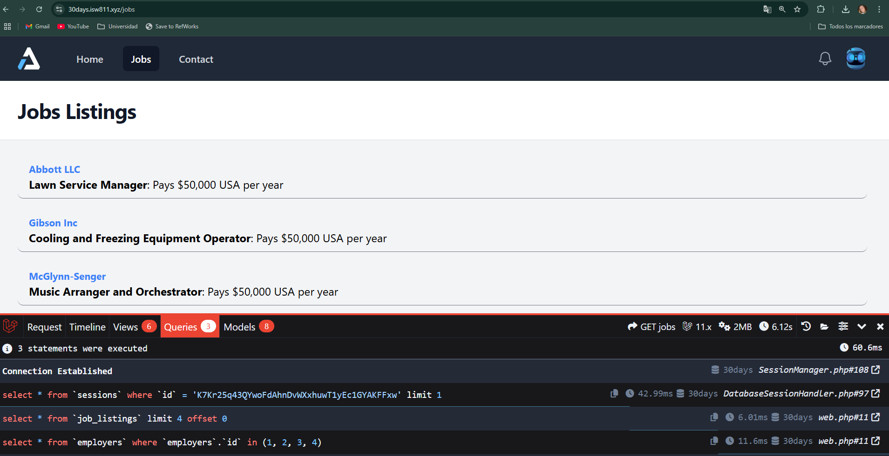
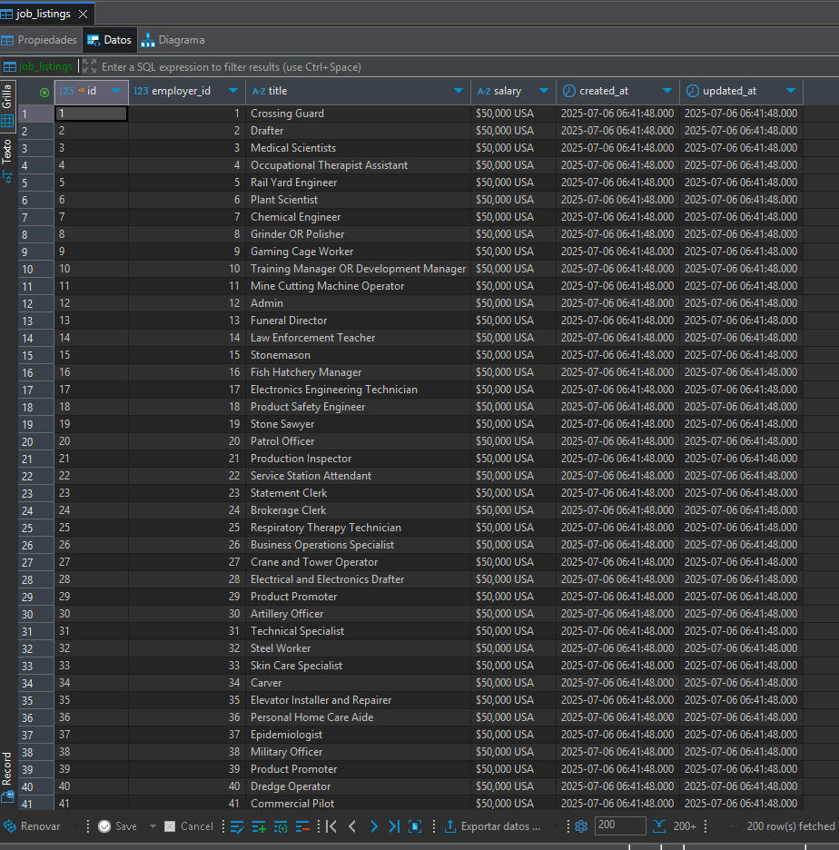

[< Volver al índice](/docs/chapter/eloquent.md)

# Eloquent - Episodios 12 a 15

## 12. Episodio 12 - Pivot Tables and BelongsToMany Relationships
En este episodio, se introducen las tablas pivot y las relaciones `BelongsToMany` en Eloquent. Se explica cómo crear una tabla pivot para manejar relaciones muchos a muchos entre modelos, como `Job` y `Tag`. Se muestra cómo definir la relación en el modelo `Job` y cómo utilizarla para acceder a los tags asociados a un job.

### Declaración de la relación en el modelo `Job`
```php
public function tags()
    {
        return $this->belongsToMany(Tag::class, 'job_tag', 'job_listing_id', 'tag_id');
    }
```

### Declaración de la relación en el modelo `Tag`
```php
public function jobs()
    {
        return $this->belongsToMany(Job::class, 'job_tag', 'tag_id', 'job_listing_id');
    }
```

### Migración para la tabla pivot `job_tag`
```php
return new class extends Migration
{
    /**
     * Run the migrations.
     */
    public function up(): void
    {
        Schema::create('tags', function (Blueprint $table) {
            $table->id();
            $table->string('name');
            $table->timestamps();
        });

        Schema::create('job_tag', function (Blueprint $table) {
            $table->id();
            $table->foreignIdFor(\App\Models\Job::class , 'job_listing_id')->constrained()->cascadeOnDelete();
            $table->foreignIdFor(\App\Models\Tag::class)->constrained()->cascadeOnDelete();
            $table->timestamps();
        });
    }

    /**
     * Reverse the migrations.
     */
    public function down(): void
    {
        Schema::dropIfExists('tags');
        Schema::dropIfExists('job_tag');
    }
};
```

### Comandos tinker para probar la relación
+ Ingresar al entorno tinker:
```bash
php artisan tinker
```
+ Buscar un job específico:
```bash
$job = App\Models\Job::find(10);
```
+ Obtener los tags asociados al job:
```bash
$job->tags;
```
+ Buscar un tag específico:
```bash
$tag = App\Models\Tag::find(5);
```
+ Obtener los jobs asociados al tag:
```bash
$tag->jobs;
```
+ Obtener los titulos de los jobs asociados al tag:
```bash
 $tag->jobs()->get()->pluck('title');
 ```

## 13. Episodio 13 - Eager Loading and the N+1 Problem
En este episodio, se aborda el problema N+1 en Eloquent y cómo solucionarlo utilizando Laravel Debugbar. Se explica cómo Eloquent carga las relaciones de forma perezosa por defecto, lo que puede llevar a múltiples consultas a la base de datos y afectar el rendimiento. Se muestra cómo utilizar `with()` para cargar relaciones de forma anticipada (eager loading) y evitar el problema N+1.

### Uso de `with()` para Eager Loading
```php
Route::get('/jobs', function () {
    $jobs = Job::with('employer')->get();

    return view('jobs', [
        'jobs' => $jobs
    ]);
});
```

### Instalación de Laravel Debugbar
Para instalar Laravel Debugbar, puedes usar Composer. Ejecuta el siguiente comando en tu terminal:

```bash
composer require barryvdh/laravel-debugbar --dev
```

Una vez instalado, Laravel Debugbar se activará automáticamente en el entorno de desarrollo. Puedes acceder a la barra de depuración en la parte inferior de tu navegador al cargar una página de tu aplicación. Se vreá así:



### Ajuste en el archivo `AppServiceProvider.php`
Para evitar la carga perezosa de modelos, puedes agregar la siguiente línea en el método `boot()` del archivo `AppServiceProvider.php`:

```php
Model::preventLazyLoading();
```
## 14. Episodio 14 - All You Need to Know About Pagination
En este episodio, se explora la paginación en Eloquent y cómo Laravel facilita la paginación de resultados. Se muestra cómo utilizar el método `paginate()` para dividir los resultados en páginas y cómo personalizar la vista de paginación.
Pero si se utiliza `simplePaginate()` en lugar de `paginate()`, se obtendrá una paginación más simple, que no incluye información sobre el número total de páginas.

### Uso de `paginate()`
```php
Route::get('/jobs', function () {
    $jobs = Job::with('employer')->paginate(3);

    return view('jobs', [
        'jobs' => $jobs
    ]);
});
```
### Uso de `simplePaginate()`
```php
Route::get('/jobs', function () {
    $jobs = Job::with('employer')->simplePaginate(3);

    return view('jobs', [
        'jobs' => $jobs
    ]);
});
```

## 15. Episodio 15 - Understanding Database Seeders
En este episodio, se introduce el concepto de "seeders" en Laravel, que son clases utilizadas para poblar la base de datos con datos iniciales. Se muestra cómo crear un seeder para el modelo `Job` y `User` y cómo utilizarlo para generar múltiples registros en la tabla `jobs_listings`.

### Creación de un Seeder para el modelo `Job`

```bash
php artisan make:seeder JobSeeder
```
### Implementación del Seeder
```php
public function run(): void
    {
        Job::factory(100)->create();
    }
```
### Uso del Seeder en `DatabaseSeeder.php`
```php
public function run(): void
    {
        // User::factory(10)->create();

        User::factory()->create([
            'first_name' => 'Andrea',
            'last_name' => 'Benavides',
            'email' => 'test@example.com',
        ]);

        $this->call(JobSeeder::class);
    }
```

### Ejecución del Seeder
+ Para ejecutar el seeder y poblar la base de datos, utiliza el siguiente comando:
```bash
php artisan db:seed
```
+ Para reiniciar la base de datos y volver a ejecutar todos los seeders, puedes usar el siguiente comando:
```bash
php artisan migrate:fresh --seed
```
+ Para ejecutar un seeder específico, puedes usar el siguiente comando:
```bash
php artisan db:seed --class=JobSeeder
```

### Verificación de los datos insertados
Puedes verificar los datos insertados en la base de datos desde DBeaver:
